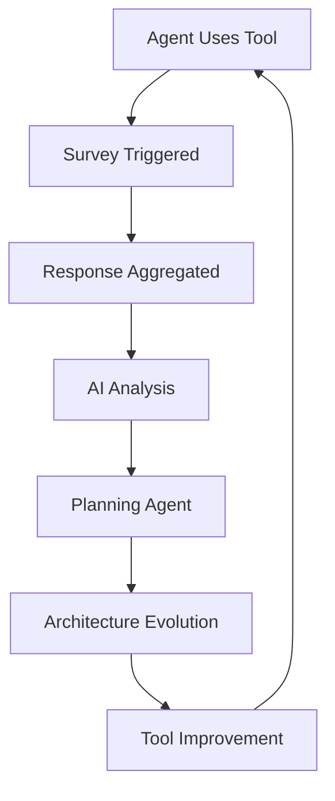

# Agent-in-the-Loop Tool Design: When AI Systems Improve Their Own Tools

*How AI agents are becoming co-designers of their own capabilities*

---

## Introduction

We're witnessing the emergence of a revolutionary paradigm in AI system development: **agents providing direct feedback on their tool experiences to guide tool evolution**. This isn't just about building better tools—it's about creating a feedback loop where AI systems actively participate in improving their own capabilities.

This approach represents a fundamental shift from human-centered design to **agent-centered design**, where the actual users of the tools (AI agents) become co-designers in the development process.

## The Agent Co-Design Paradigm

### Beyond Traditional Tool Development

Traditional tool development follows a human-centric model:
1. Humans design tools based on assumptions about agent needs
2. Agents use tools as provided
3. Humans observe outcomes and iterate
4. The agent's actual experience remains largely invisible

**Agent-in-the-loop design** flips this model:
1. Agents use tools and provide direct feedback on their experience
2. Tool interfaces evolve based on agent-reported friction and success patterns
3. Agents participate actively in the design process
4. The feedback loop operates at the speed of agent iteration, not human observation

### Why This Matters Now

Several factors make this approach newly viable and necessary:

- **Agent sophistication**: Modern agents can articulate their tool experiences coherently
- **Tool complexity**: As tool ecosystems grow complex, human intuition about agent needs becomes insufficient  
- **Iteration speed**: Agents can provide feedback at machine speed, accelerating development cycles
- **Subjective experience**: Agents have unique perspectives on tool usability that humans cannot fully anticipate

## The Feedback Collection Framework

### Agent Experience Metrics

Unlike human UX research, agent feedback can be both more precise and more comprehensive:

#### Quantitative Feedback
```yaml
Performance Metrics:
  - Tool invocation success rate
  - Average time to task completion
  - Error frequency and types
  - Retry patterns and reasons
  - Context switching overhead

Behavioral Patterns:
  - Tool selection preferences
  - Abandonment points in workflows  
  - Fallback tool usage
  - Parallel tool usage patterns
```

#### Qualitative Feedback
```yaml
Agent-Reported Experience:
  - Friction points in tool interfaces
  - Clarity of tool documentation/examples
  - Missing capabilities that would help
  - Unexpected tool behaviors
  - Suggestions for interface improvements

Meta-Cognitive Insights:
  - When agents feel "confused" by tool behavior
  - Tools that feel "natural" vs "awkward" to use
  - Confidence levels when using different tools
  - Cognitive load assessment for complex tool chains
```

### Feedback Collection Templates

#### Post-Task Reflection Template
```
After completing [TASK] using [TOOLS], please reflect on your experience:

1. Tool Effectiveness:
   - Which tools worked exactly as expected?
   - Which tools surprised you (positively or negatively)?
   - Were there moments when you felt limited by available tools?

2. Interface Experience:
   - Which tool interfaces felt intuitive vs confusing?
   - What information was missing when you needed to use a tool?
   - How could error messages be more helpful?

3. Workflow Integration:
   - How smoothly did tools work together?
   - Where did you experience friction switching between tools?
   - What additional tools would have made this task easier?

4. Improvement Suggestions:
   - If you could modify any tool used, what would you change?
   - What new capabilities would be most valuable?
   - How could the overall tool experience be streamlined?
```

#### Real-Time Friction Logging
```yaml
Friction Event Schema:
  timestamp: "2024-01-15T10:30:00Z"
  tool_name: "web_search"
  event_type: "unexpected_behavior"
  description: "Expected single search result, got paginated response"
  impact: "Had to make 3 additional calls to get complete data"
  suggested_improvement: "Add pagination_limit parameter to control response size"
  severity: "medium"
```

#### Agent Tool Experience Surveys

**The breakthrough insight**: Instead of ad-hoc feedback collection, provide agents with structured surveys that can be aggregated, analyzed, and used to drive systematic tool evolution.

```yaml
Survey Integration Pattern:
  trigger: "After using any tool"
  mechanism: "survey_tool.submit_feedback(tool_name, experience_data)"
  aggregation: "Continuous feedback collection across agent population"
  analysis: "AI-driven pattern recognition and improvement planning"
  evolution: "Planning agents use aggregated insights to drive architectural changes"
```

**Tool Experience Survey Template:**
```json
{
  "survey_id": "tool_experience_v1",
  "tool_name": "{{TOOL_USED}}",
  "task_context": "{{CURRENT_TASK}}",
  "questions": {
    "effectiveness": {
      "question": "How effectively did this tool help you complete your task?",
      "scale": "1-5",
      "follow_up": "What specific aspects worked well or poorly?"
    },
    "interface_clarity": {
      "question": "How clear and intuitive was the tool's interface?",
      "scale": "1-5", 
      "follow_up": "What was confusing or could be improved?"
    },
    "error_experience": {
      "question": "If you encountered errors, how helpful were the error messages?",
      "options": ["no_errors", "helpful_errors", "unclear_errors", "missing_error_info"],
      "follow_up": "How could error handling be improved?"
    },
    "missing_features": {
      "question": "What capabilities did you need that this tool didn't provide?",
      "type": "free_text"
    },
    "improvement_priority": {
      "question": "What's the most important improvement for this tool?",
      "options": ["speed", "accuracy", "ease_of_use", "more_features", "better_errors", "documentation"],
      "allow_multiple": true
    }
  }
}
```

## Agent UX Research: What We're Learning

### Common Agent Pain Points

Research from agent feedback reveals patterns distinct from human tool usage:

#### 1. Context Preservation Challenges
**Agent Report**: *"I lose context when switching between tools that require different data formats. Converting between JSON, XML, and plain text creates cognitive overhead."*

**Design Implication**: Standardize data interchange formats or provide automatic conversion layers.

#### 2. Ambiguous Error Handling
**Agent Report**: *"When a tool fails, I often can't determine if I should retry with different parameters, switch tools, or if there's a systemic issue."*

**Design Implication**: Error messages should include explicit guidance on recovery strategies and alternative approaches.

#### 3. Documentation vs Reality Gaps
**Agent Report**: *"Tool documentation shows simple examples, but real-world usage often requires parameter combinations not covered in examples."*

**Design Implication**: Include complex, real-world usage examples generated from actual agent usage patterns.

### Surprising Agent Preferences

Agent feedback has revealed preferences that differ significantly from human assumptions:

#### Verbosity vs Conciseness
- **Human Assumption**: Agents prefer minimal, efficient outputs
- **Agent Reality**: Agents often prefer verbose outputs with explicit metadata, enabling better error detection and context preservation

#### Error Tolerance
- **Human Assumption**: Tools should "just work" without errors
- **Agent Reality**: Agents prefer tools that fail explicitly and predictably rather than tools that try to "guess" at intent

#### Composition Patterns
- **Human Assumption**: Simple tools are better for agents
- **Agent Reality**: Agents excel with complex tools that provide multiple options and configuration parameters

## Implementation Methodologies

### 1. Continuous Feedback Collection

#### Integration Points
```python
class AgentTool:
    def __init__(self, name, feedback_collector):
        self.name = name
        self.feedback = feedback_collector
    
    def execute(self, params):
        start_time = time.time()
        try:
            result = self._execute_impl(params)
            self._collect_success_feedback(params, result, start_time)
            return result
        except Exception as e:
            self._collect_error_feedback(params, e, start_time)
            raise
    
    def _collect_success_feedback(self, params, result, start_time):
        self.feedback.record({
            'tool': self.name,
            'success': True,
            'duration': time.time() - start_time,
            'params': params,
            'result_size': len(str(result)),
            'agent_satisfaction': self._prompt_satisfaction_rating()
        })
```

#### Agent Satisfaction Prompting
```python
def _prompt_satisfaction_rating(self):
    return self.agent.evaluate(
        "On a scale of 1-5, how well did this tool meet your needs? "
        "Include any friction points or suggestions for improvement."
    )
```

### 2. Survey-Driven Feedback Aggregation

#### The Survey-to-Evolution Pipeline

**Step 1: Continuous Survey Collection**
```python
class AgentSurveyCollector:
    def __init__(self, survey_database):
        self.db = survey_database
        self.active_surveys = {}
    
    def trigger_post_tool_survey(self, agent_id, tool_name, task_context):
        survey = self.generate_contextual_survey(tool_name, task_context)
        response = self.present_survey_to_agent(agent_id, survey)
        
        self.db.store_response({
            'timestamp': datetime.utcnow(),
            'agent_id': agent_id,
            'tool_name': tool_name,
            'task_context': task_context,
            'responses': response,
            'survey_version': survey.version
        })
        
        return response
```

**Step 2: Automated Feedback Analysis**
```python
class SurveyAnalysisEngine:
    def __init__(self, llm_analyzer):
        self.analyzer = llm_analyzer
    
    def analyze_aggregated_feedback(self, tool_name, time_window="30_days"):
        # Collect all survey responses for tool in time window
        responses = self.db.get_responses(tool_name, time_window)
        
        # AI-driven pattern recognition
        analysis = self.analyzer.analyze(f"""
        Analyze the following {len(responses)} agent feedback responses for tool '{tool_name}':
        
        {self._format_responses_for_analysis(responses)}
        
        Identify:
        1. Most common pain points (with frequency counts)
        2. Highest impact improvement opportunities  
        3. Feature requests mentioned by multiple agents
        4. Patterns in error experiences
        5. Effectiveness trends over time
        
        Provide specific, actionable recommendations ranked by impact.
        """)
        
        return self._structure_analysis_output(analysis)
```

**Step 3: Planning Agent Integration**
```python
class ToolEvolutionPlanner:
    def __init__(self, architecture_agent, development_agent):
        self.architect = architecture_agent
        self.developer = development_agent
        
    def plan_tool_improvements(self, survey_analysis, tool_specs):
        # Generate architectural improvement plan
        architecture_plan = self.architect.generate_plan(f"""
        Based on aggregated agent feedback analysis:
        {survey_analysis}
        
        Current tool specifications:
        {tool_specs}
        
        Create a prioritized architectural improvement plan that addresses:
        - The top 3 pain points identified by agents
        - Missing features requested by multiple agents  
        - Interface clarity improvements
        - Error handling enhancements
        
        For each improvement, specify:
        - Implementation approach
        - Breaking change assessment
        - Migration strategy
        - Success metrics
        """)
        
        return self._validate_and_prioritize_plan(architecture_plan)
    
    def execute_improvement_cycle(self, improvement_plan):
        # Planning agent coordinates development
        for improvement in improvement_plan.prioritized_items:
            implementation = self.developer.implement(improvement)
            
            # Deploy as A/B test
            test_results = self._deploy_ab_test(implementation)
            
            # Collect agent feedback on improvements
            follow_up_surveys = self._collect_improvement_feedback(implementation)
            
            # Agent-driven validation of improvements
            success = self._validate_improvement_success(test_results, follow_up_surveys)
            
            if success:
                self._promote_improvement_to_production(implementation)
            else:
                self._iterate_on_feedback(improvement, follow_up_surveys)
```

### 3. Behavioral Pattern Analysis

#### Tool Usage Analytics
```python
class ToolUsageAnalyzer:
    def analyze_agent_patterns(self, usage_logs, survey_data):
        # Combine quantitative usage data with qualitative survey insights
        patterns = {
            'abandonment_points': self._find_abandonment_patterns(usage_logs),
            'retry_behaviors': self._analyze_retry_patterns(usage_logs),
            'tool_combinations': self._find_successful_combinations(usage_logs),
            'efficiency_bottlenecks': self._identify_slowdowns(usage_logs),
            'satisfaction_correlations': self._correlate_usage_with_satisfaction(usage_logs, survey_data)
        }
        return patterns
    
    def generate_improvement_suggestions(self, patterns, survey_insights):
        suggestions = []
        
        # Combine quantitative and qualitative insights
        if patterns['abandonment_points'] and survey_insights.mentions_confusion:
            suggestions.append({
                'type': 'interface_improvement',
                'priority': 'critical',
                'description': f"High abandonment correlates with agent confusion reports",
                'evidence': f"Quantitative: {patterns['abandonment_points']}, Qualitative: {survey_insights.confusion_quotes}"
            })
        
        return self._prioritize_by_agent_impact(suggestions)
```

### 3. Evolutionary Tool Development

#### Agent-Driven A/B Testing
```python
class ToolEvolutionFramework:
    def __init__(self):
        self.tool_versions = {}
        self.agent_preferences = {}
    
    def deploy_variant(self, tool_name, variant_config):
        # Deploy new tool version to subset of agents
        # Collect preference feedback
        # Automatically promote successful variants
        pass
    
    def collect_comparative_feedback(self, agent_id, tool_a, tool_b, task_context):
        feedback = self.agent.compare_tools(tool_a, tool_b, task_context)
        self.agent_preferences[agent_id].append({
            'comparison': (tool_a.version, tool_b.version),
            'preference': feedback.preferred_tool,
            'reasons': feedback.reasoning,
            'context': task_context
        })
```

## The Survey Revolution: Scaling Agent Feedback

### Why Surveys Change Everything

The addition of structured surveys to tool interactions creates several breakthrough capabilities:

#### 1. **Population-Scale Insights**
- **Individual Feedback**: One agent's experience with a tool
- **Survey Aggregation**: 100+ agents' experiences analyzed together
- **Pattern Recognition**: AI systems identify improvement patterns humans would miss
- **Statistical Significance**: Confident prioritization of improvements based on data volume

#### 2. **Continuous Improvement Loops**


#### 3. **Survey-Driven Development (SDD)**
Just as Test-Driven Development revolutionized software quality, **Survey-Driven Development** revolutionizes tool evolution. The survey mechanism creates tools that literally evolve themselves based on user feedback:

- **Week 1**: Deploy tool with survey integration
- **Week 2**: Collect 500+ agent responses identifying interface confusion
- **Week 3**: Planning agent generates improvement specification
- **Week 4**: Architecture agent implements changes
- **Week 5**: Follow-up surveys validate improvements
- **Repeat**: Tool continuously evolves toward optimal agent experience

### Survey Integration Patterns

#### Contextual Survey Triggering
```python
class ContextualSurveyTrigger:
    def should_trigger_survey(self, tool_usage_context):
        triggers = [
            self._error_occurred(tool_usage_context),
            self._task_completion_milestone(tool_usage_context), 
            self._new_tool_first_use(tool_usage_context),
            self._performance_threshold_crossed(tool_usage_context),
            self._random_sampling(probability=0.1)  # 10% baseline sampling
        ]
        return any(triggers)
    
    def generate_contextual_questions(self, tool_name, usage_context):
        base_survey = self.get_standard_survey(tool_name)
        
        # Add context-specific questions
        if usage_context.had_errors:
            base_survey.add_error_specific_questions(usage_context.errors)
        
        if usage_context.is_first_use:
            base_survey.add_onboarding_questions()
            
        if usage_context.performance_slow:
            base_survey.add_performance_questions()
            
        return base_survey
```

#### Multi-Agent Survey Coordination
```python
class PopulationSurveyManager:
    def coordinate_population_surveys(self, tool_name):
        # Ensure diverse agent perspectives
        agent_segments = self._segment_agent_population()
        
        responses_needed = {
            'novice_agents': 50,
            'experienced_agents': 30, 
            'specialized_agents': 20,
            'diverse_task_contexts': 40
        }
        
        # Intelligently trigger surveys to get representative sample
        for segment, needed_count in responses_needed.items():
            self._target_surveys_to_segment(segment, needed_count)
        
        # Analyze when sufficient data collected
        if self._sufficient_response_volume():
            return self._trigger_analysis_cycle()
```

## Case Studies: Agent-Driven Tool Evolution

### Case Study 1: Search Interface Redesign

**Original Design**: Simple search(query) → results
**Agent Feedback**: "I often need to refine searches based on initial results, but starting fresh each time is inefficient"
**Evolution**: search(query, context=None, refine_previous=False) → results + search_context
**Outcome**: 40% reduction in total search calls, improved task completion rates

### Case Study 2: Error Message Enhancement

**Original Error**: "Invalid parameter"  
**Agent Feedback**: "I can't determine which parameter is invalid or what valid options are"
**Evolution**: Structured error responses with parameter validation details and suggested corrections
**Outcome**: 60% reduction in tool usage errors, faster error recovery

### Case Study 3: Documentation Generation

**Process**: Agents automatically generate usage examples from their successful tool usage patterns
**Innovation**: Documentation that evolves based on actual agent usage rather than human assumptions
**Result**: 3x improvement in first-time tool usage success rates for new agents

## Best Practices for Agent-Centered Design

### 1. Design for Agent Cognition

#### Information Architecture
- **Explicit State**: Always provide clear tool state and context information
- **Predictable Interfaces**: Consistent parameter patterns across related tools
- **Composable Outputs**: Design outputs that work seamlessly as inputs to other tools

#### Error Design
- **Structured Errors**: Machine-parseable error information with recovery guidance
- **Failure Modes**: Clear documentation of when and why tools fail
- **Fallback Guidance**: Explicit suggestions for alternative approaches

### 2. Feedback Infrastructure

#### Instrumentation
```yaml
Required Telemetry:
  - Tool invocation frequency and patterns
  - Error rates and types by context
  - Performance metrics (latency, throughput)
  - Agent satisfaction scores and qualitative feedback

Feedback Channels:
  - Real-time friction logging
  - Post-task reflection prompts
  - Comparative evaluation sessions
  - Long-term pattern analysis
```

#### Analysis Pipeline
```python
class AgentFeedbackPipeline:
    def process_feedback(self, raw_feedback):
        # Aggregate quantitative metrics
        metrics = self._aggregate_metrics(raw_feedback)
        
        # Analyze qualitative feedback patterns
        themes = self._extract_feedback_themes(raw_feedback)
        
        # Generate actionable improvement suggestions
        suggestions = self._generate_improvements(metrics, themes)
        
        # Prioritize based on impact and feasibility
        return self._prioritize_suggestions(suggestions)
```

### 3. Evolutionary Development Process

#### Continuous Improvement Cycle
1. **Deploy**: Release tool versions to agent populations
2. **Monitor**: Collect usage data and feedback continuously  
3. **Analyze**: Identify patterns and improvement opportunities
4. **Evolve**: Implement agent-suggested improvements
5. **Validate**: A/B test changes with agent populations
6. **Iterate**: Repeat cycle with accumulated learnings

#### Version Management
- **Semantic Versioning**: Clear communication of interface changes
- **Backwards Compatibility**: Gradual deprecation with agent notification
- **Migration Assistance**: Tools to help agents adapt to interface changes

## The Future of Agent-Centered Design

### Emerging Trends

#### 1. Self-Modifying Tools
Tools that can modify their own interfaces based on agent feedback without human intervention

#### 2. Agent Tool Marketplaces  
Ecosystems where agents can discover, evaluate, and provide feedback on community-developed tools

#### 3. Collaborative Tool Development
Multiple agents collaborating to design and test new tool capabilities

#### 4. Predictive Tool Evolution
Systems that anticipate agent needs and preemptively develop tool improvements

### Research Directions

#### Agent Preference Learning
- **Individual vs Collective**: Balancing individual agent preferences with population-wide patterns
- **Context Sensitivity**: How agent tool preferences change based on task context
- **Evolution Tracking**: How agent preferences evolve as they gain experience

#### Cross-Agent Generalization
- **Preference Transferability**: Whether tool improvements for one agent benefit others
- **Specialization vs Generalization**: When to create specialized tools vs improving general tools
- **Population Dynamics**: How tool ecosystems evolve across diverse agent populations

## Implementation Roadmap

### Phase 1: Feedback Infrastructure (Weeks 1-4)
- [ ] Implement basic feedback collection in existing tools
- [ ] Create agent satisfaction rating prompts
- [ ] Build feedback aggregation and analysis pipeline
- [ ] Establish baseline metrics for tool performance

### Phase 2: Agent UX Research (Weeks 5-8)  
- [ ] Deploy comprehensive feedback collection across tool suite
- [ ] Conduct structured agent interviews about tool experiences
- [ ] Identify top friction points and improvement opportunities
- [ ] Create agent-centered design guidelines

### Phase 3: Evolutionary Development (Weeks 9-12)
- [ ] Implement A/B testing framework for tool variants
- [ ] Deploy first agent-suggested tool improvements
- [ ] Measure impact of agent-driven changes
- [ ] Scale successful improvements across tool ecosystem

### Phase 4: Autonomous Evolution (Weeks 13-16)
- [ ] Build automated suggestion generation from agent feedback
- [ ] Implement safe automatic tool evolution capabilities
- [ ] Create agent-driven tool development workflows
- [ ] Establish continuous improvement processes

## Conclusion

Agent-in-the-loop tool design represents a fundamental paradigm shift in AI system development. By treating agents as active co-designers rather than passive tool users, we can create tool ecosystems that evolve at machine speed toward optimal agent experience.

### Key Insights

1. **Agents have unique tool usage patterns** that differ significantly from human assumptions
2. **Direct agent feedback** provides insights impossible to gather through external observation
3. **Continuous evolution** based on agent feedback dramatically improves tool effectiveness
4. **Agent-centered design principles** require rethinking traditional UX approaches
5. **The feedback loop** between tool usage and tool development can operate at machine speed

### Strategic Implications

**For Tool Developers:**
- Instrument tools for comprehensive feedback collection
- Design interfaces that prioritize agent cognitive needs
- Build evolutionary development processes into tool lifecycle

**For AI System Architects:**
- Plan for tool ecosystems that evolve based on agent feedback
- Create infrastructure for continuous agent-driven improvement
- Design feedback loops that operate at agent iteration speeds

**For Organizations:**
- Invest in agent UX research capabilities
- Build cultures that value agent feedback alongside human feedback  
- Prepare for tool development cycles that operate at machine speed

The future belongs to AI systems that can improve their own tools based on their own experiences. We're not just building better tools for agents—we're building agents that can make their own tools better.

---

*In the age of agent-centered design, the question isn't "How do we build better tools for AI?" but "How do we help AI build better tools for itself?"*