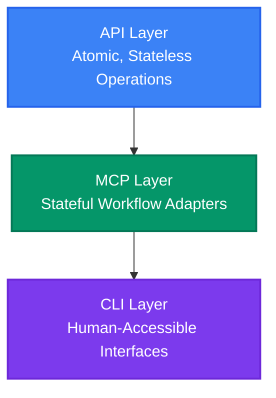

The model context protocol has been extremely polarizing. When it was initially launched, it was met with fanfare and rapid adoption, but it had a lot of issues, and a small contingent came out against it soon afterwards. I won't go into much detail on the issues with MCP as those have been extensively covered elsewhere, but to summarize:

* Tool definitions and output waste context
* Models suffer from tool confusion/use tools less efficiently than code/CLIs.

Early MCP detractors mostly focused on letting agents write code to call tools, and bash/CLIs were among the options discussed, but at that time consensus hadn't coalesced. I was a vocal early proponent of using bash and CLIs for everything (as far back as May 2025), so watching the industry slowly come around to my position nearly a year later feels pretty good.

So, as someone who was critical of MCP initially, and called the direction the industry was going to evolve well in advance, it's worth considering when I say that I've changed my mind about it. I think it's actually very useful, but not for the reasons people initially thought.

MCP ironically isn't directly useful for agents. As a protocol, it doesn't even really do anything that a bunch of protocols before it didn't do better. What it does very well is force integration providers to think about how to bundle capabilities for agentic use, and to package them in a standardized way. The *intent* of being *for agents* is load bearing.

I've had great success with MCP as a unit of isolation for workflows and capabilities. My autonomous agent framework [Smith](https://github.com/sibyllinesoft/smith-core) uses MCP servers plugged into a service mesh via sidecar to provide capabilities to agents. The benefit of this is that you can re-use the battle hardened policy and monitoring infrastructure that enterprises have been using for years with basically no changes. Want authorization control and dashboards? No need to re-invent the wheel, just plug in OPA/Grafana.

Under this configuration, the primary way that agents utilize capabilities is via curl in bash against the service mesh. This gives you most of the same benefits as using CLIs to invoke capabilities. CLIs are still slightly more token efficient, and help output is more discoverable than OpenAPI spec endpoints, so CLIs still have a place, but as an optimization rather than the foundation.

The astute reader might be wondering at this point: if I'm just plugging MCPs into a service mesh, why not just hit the underlying API via proxy directly?

That's a reasonable question, and in some cases it's a good choice, but MCP servers let you craft more agent-specific interfaces. Consider:

* APIs surface low level operations, agents want workflows
* APIs are (usually) stateless, but workflows are (usually) stateful

If your agent is directly consuming APIs, the stateful portion of the workflow is being maintained in the agent's context, which is both wasteful and error prone. This logic makes sense to be decoupled and stateless in a typical API because consumers are themselves deterministic programs that can cleanly compose atomic operations, but decoupling it in agents is a big mistake. You want to give your agents streamlined golden pathways, like the wizards of old. Think JRPG, not Open World.

Consider something as simple as a TODO list. A typical API gives you CRUD: create task, list tasks, update task, delete task. That's the right abstraction for a deterministic program that manages its own control flow. But an agent consuming those endpoints has to track which task it's working on, figure out what's next, check for blockers, and maintain all of that state in its context window. That's a lot of tokens spent on bookkeeping, and it's fragile — one confused step and the agent loses its place.

A stateful MCP server can instead present a finite state machine: `get_current_task`, `complete_task`, `skip_task`, `get_blocked_tasks`. The server maintains workflow position internally, and the agent only ever sees the valid transitions from where it currently stands. You've collapsed an open-ended state management problem into a guided walkthrough. The agent doesn't need to reason about what's valid, it just follows the rails. This is what I mean by "wizard" — you're not giving the agent a map and a compass, you're giving it a path.

I'm still on board the CLI-train in general because unlike MCPs, CLIs are human accessible and they are a bit better in a few ways as previously mentioned. I don't believe we should consider it an either-or situation though. MCPs through a service mesh provide 90% of the benefit of CLIs without needing to deploy or secure binaries, while also bringing their own benefits, and they're not CLI exclusive. You can start with a MCP solution and write CLIs on top of them to make them human accessible (most CLIs are already dumb service wrappers anyhow).

To be extra clear, what I'm talking about here is a three tier architecture for capabilities:

The **API layer** is your foundation: atomic, stateless operations designed for deterministic systems. Ideally you don't expose this directly to agents — the granularity is too fine and it'll distract them from the task at hand, unless your business logic is genuinely simple. The **MCP layer** sits on top as a stateful, workflow-oriented adapter. This is your AI wizard — it consumes the API internally and presents the agent with guided pathways. Transport is irrelevant here; what matters is the interface shape. The **CLI layer** is for heavily-used capabilities where you want to squeeze out a bit more token efficiency, or for things humans need to access directly.

A really nice side-effect of providing your agent capabilities through a service mesh (which can also be exposed via CLI) is that securing your harness becomes trivial. You don't need a fancy sandboxing solution because all capabilities are controlled at the network level, just basic VM isolation is enough.

This maps cleanly onto zero trust architecture, which is a nice bonus for anyone who has to get this past a security review. Every capability invocation is an authenticated network call through the mesh. The agent has no ambient authority — it can't do anything that isn't explicitly exposed through a service endpoint, and every call is subject to policy enforcement and logged for audit. You get identity, authorization, rate limiting and observability without building any of it yourself, because your service mesh already has all of this. The agent's execution environment can be a bare VM with network access to the mesh and nothing else. No filesystem access to protect, no credentials to leak, no sandbox escape to worry about. The blast radius of a compromised agent is bounded by what the mesh allows, which is exactly the set of capabilities you intentionally gave it.

MCP's lasting contribution to the AI ecosystem won't be the protocol itself. JSON-RPC over stdio is nobody's idea of a breakthrough. The real value is that it forced an entire industry to think about how to package capabilities for agents — to consider the interface shape, the granularity, the statefulness. That mindset shift is permanent, and it's useful regardless of whether MCP the protocol survives long term. The protocol is a means, not the end.

